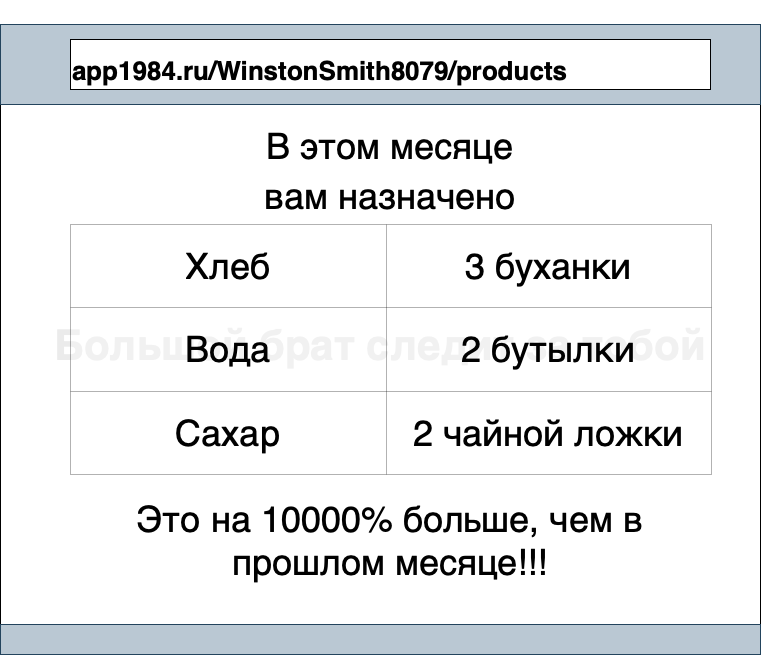
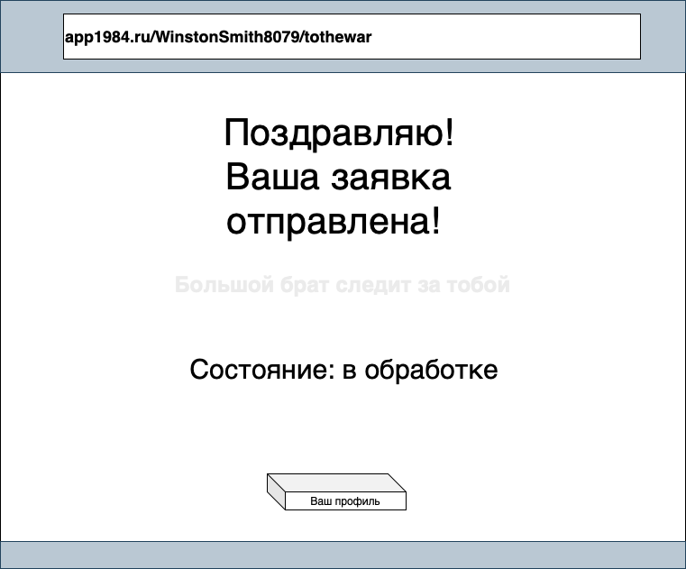
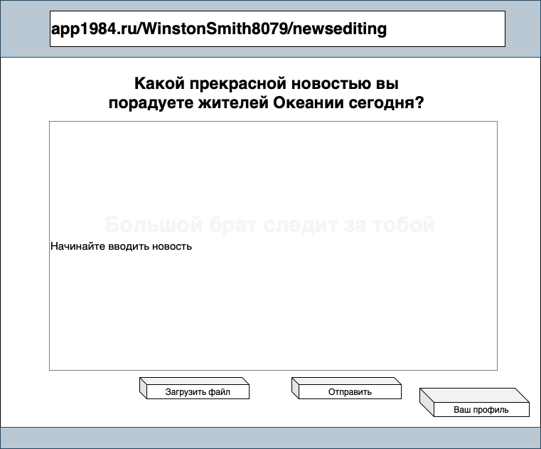
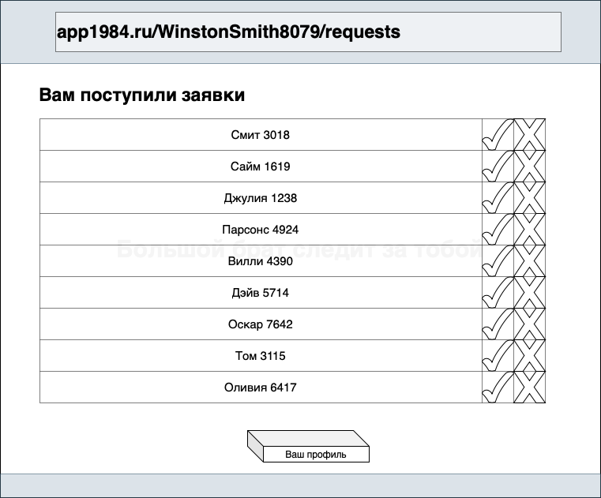
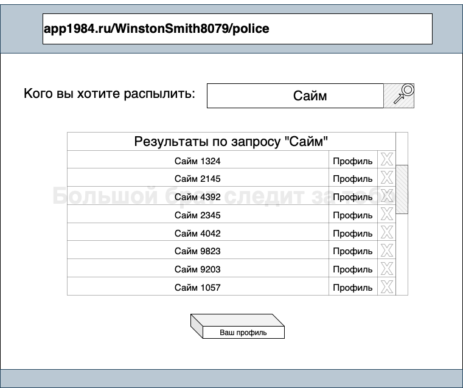
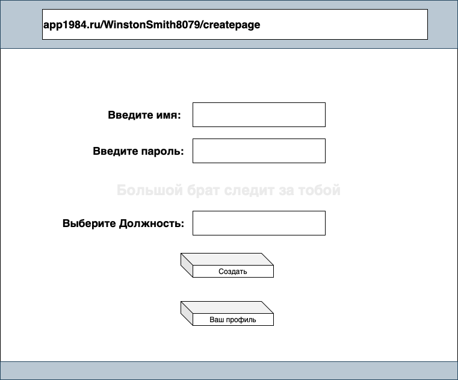

# Проектирование интерфейсов
## 1. Список интерфейсов
- Новый гражданин (впервые в нашем приложении)
- - Авторизация (Регистрируют новых граждан члены внутренней партии, поэтому логин и пароль можно получить только от них лично)
- Прол
- - Стартовая страница
- - 

## 2. Эскизы интерфейсов
### Стартовая страница

### Прол
.drawio.png)

### Член Внешней партии
.drawio.png)

### Член Внутренней партии
.drawio.png)

